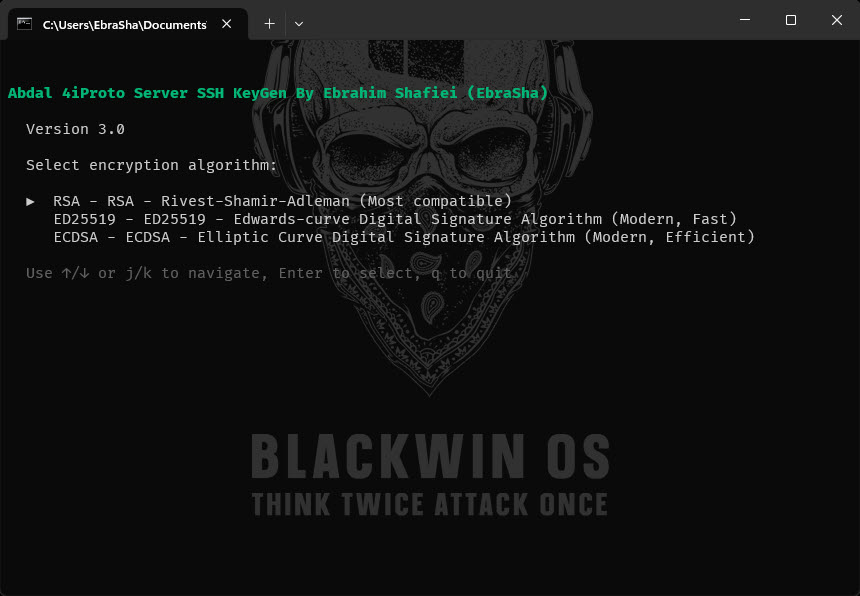

# 🔐 ابزار تولید کلید SSH برای سرور 4iProto ابدال

<div align="right">
  
</div>

ابزار قدرتمند و تعاملی تولید کلید SSH با نوار پیشرفت زیبا و رابط کاربری دوستانه.

## 📘 زبان‌های دیگر

- [🇬🇧 English - انگلیسی](README.md)


## 🌟 قابلیت‌ها

### ✨ حالت تعاملی
- **منوی انتخاب الگوریتم**: انتخاب از بین الگوریتم‌های رمزنگاری RSA، ED25519 یا ECDSA
- **نوار پیشرفت زیبا**: نوار پیشرفت انیمیشن‌دار در زمان واقعی با استفاده از Bubbletea
- **تأیید بازنویسی**: دیالوگ تأیید هوشمند هنگام وجود فایل‌های موجود
- **انیمیشن‌های روان**: رابط کاربری حرفه‌ای با پیام‌های رنگی
- **انتظار برای ورودی کاربر**: مکث قبل از خروج برای نمایش نتایج
- **نام‌گذاری خودکار فایل‌ها**: فایل‌ها بر اساس الگوریتم انتخاب شده به صورت خودکار نام‌گذاری می‌شوند

### ⚡ حالت غیرتعاملی
- **آرگومان‌های خط فرمان**: پشتیبانی کامل از تمام پرچم‌های سنتی
- **انتخاب الگوریتم**: انتخاب الگوریتم از طریق پرچم `-t` (rsa، ed25519، ecdsa)
- **بازنویسی اجباری**: پرچم `-force` برای بازنویسی فایل‌های موجود
- **اندازه کلید سفارشی**: اندازه بیت کلید قابل تنظیم بر اساس الگوریتم
- **خروجی سفارشی**: نام‌گذاری انعطاف‌پذیر فایل و نظرات
- **نام‌گذاری خودکار فایل‌ها**: فایل‌ها بر اساس الگوریتم انتخاب شده به صورت خودکار نام‌گذاری می‌شوند

### 🎨 تجربه کاربری
- **پیام‌های رنگی**: سبز برای موفقیت، قرمز برای خطا، نارنجی برای هشدار
- **استایل حرفه‌ای**: رابط کاربری ترمینال تمیز با فاصله‌گذاری مناسب
- **طراحی واکنش‌گرا**: سازگار با اندازه‌های مختلف ترمینال
- **آیکون‌های ایموجی**: بازخورد بصری برای تجربه کاربری بهتر

## 🚀 نصب

### پیش‌نیازها
- Go 1.24.0 یا بالاتر
- Git

### ساخت از کد منبع
```bash
git clone https://github.com/ebrasha/abdal-4iproto-server-ssh-keygen.git
cd abdal-4iproto-server-ssh-keygen
go mod tidy
go build -o abdal-4iproto-server-ssh-keygen .
```
 
## 📖 نحوه استفاده

### حالت تعاملی (توصیه شده)
فقط برنامه را بدون آرگومان اجرا کنید:

```bash
./abdal-4iproto-server-ssh-keygen
```

**چه اتفاقی می‌افتد:**
1. 🔐 **انتخاب الگوریتم**: انتخاب الگوریتم رمزنگاری (RSA، ED25519 یا ECDSA)
   - از کلیدهای ↑/↓ یا j/k برای ناوبری استفاده کنید
   - Enter یا Space را برای انتخاب فشار دهید
   - q را برای خروج فشار دهید
2. 🔍 بررسی فایل‌های کلید موجود
3. ⚠️ نمایش دیالوگ تأیید در صورت وجود فایل‌ها
4. 📊 نمایش نوار پیشرفت زیبا در حین تولید
5. ✅ نمایش پیام موفقیت با جزئیات فایل
6. ⌨️ انتظار برای فشردن کلید برای خروج

**نحوه ناوبری در منوی انتخاب الگوریتم:**
- **↑ یا k**: حرکت انتخاب به بالا
- **↓ یا j**: حرکت انتخاب به پایین
- **Enter یا Space**: انتخاب الگوریتم
- **q**: خروج از برنامه

### حالت غیرتعاملی
از آرگومان‌های خط فرمان برای خودکارسازی استفاده کنید:

```bash
# تولید کلید RSA (پیش‌فرض)
./abdal-4iproto-server-ssh-keygen -t rsa -b 4096

# تولید کلید ED25519
./abdal-4iproto-server-ssh-keygen -t ed25519

# تولید کلید ECDSA با P-256
./abdal-4iproto-server-ssh-keygen -t ecdsa -b 256

# تولید کلید ECDSA با P-384
./abdal-4iproto-server-ssh-keygen -t ecdsa -b 384

# تولید کلید با نام فایل سفارشی
./abdal-4iproto-server-ssh-keygen -t ed25519 -f my_key

# تولید کلید با comment
./abdal-4iproto-server-ssh-keygen -t ecdsa -b 521 -C "server@example.com"

# بازنویسی اجباری فایل‌های موجود
./abdal-4iproto-server-ssh-keygen -t rsa -b 2048 -force -f existing_key
```

### گزینه‌های خط فرمان

| پرچم | توضیحات | پیش‌فرض | مثال |
|------|---------|---------|------|
| `-t` | نوع/الگوریتم کلید: rsa، ed25519 یا ecdsa | rsa | `-t ed25519` |
| `-b` | اندازه کلید بر حسب بیت (RSA: 2048,3072,4096,8192 \| ECDSA: 256,384,521) | 4096 | `-b 2048` |
| `-f` | نام فایل خروجی برای کلید خصوصی (در صورت عدم تعیین، به صورت خودکار نام‌گذاری می‌شود) | id_rsa/id_ed25519/id_ecdsa | `-f my_key` |
| `-C` | نظر کلید | "" | `-C "user@host"` |
| `-force` | بازنویسی فایل‌های موجود | false | `-force` |

## 🔐 الگوریتم‌های رمزنگاری پشتیبانی شده

ابزار از چندین الگوریتم رمزنگاری پشتیبانی می‌کند:

### RSA (Rivest-Shamir-Adleman)
- **اندازه‌های کلید**: 2048، 3072، 4096، 8192 بیت
- **پیش‌فرض**: 4096 بیت
- **بهترین برای**: حداکثر سازگاری با سیستم‌های قدیمی
- **نام فایل‌ها**: `id_rsa` / `id_rsa.pub`

### ED25519 (Edwards-curve Digital Signature Algorithm)
- **اندازه کلید**: 256 بیت (ثابت)
- **بهترین برای**: سیستم‌های مدرن، سریع و امن
- **نام فایل‌ها**: `id_ed25519` / `id_ed25519.pub`

### ECDSA (Elliptic Curve Digital Signature Algorithm)
- **اندازه‌های کلید**: P-256، P-384، P-521
- **پیش‌فرض**: P-256
- **بهترین برای**: سیستم‌های مدرن، کارآمد و امن
- **نام فایل‌ها**: `id_ecdsa` / `id_ecdsa.pub`

 

## 🛠️ جزئیات فنی

### وابستگی‌ها
- **Bubbletea**: چارچوب رابط کاربری ترمینال تعاملی
- **Bubbles**: اجزای رابط کاربری (نوار پیشرفت)
- **Lipgloss**: استایل‌دهی و رنگ‌های ترمینال
- **Go Crypto**: تولید و کدگذاری کلید SSH
- **golang.org/x/crypto/ed25519**: تولید کلید ED25519
- **golang.org/x/crypto/ssh**: کدگذاری و فرمت‌دهی کلید SSH

 
 
 

## 🐛 گزارش مشکلات
اگر با مشکلی مواجه شدید یا در پیکربندی مشکل دارید، لطفاً از طریق ایمیل Prof.Shafiei@Gmail.com با ما در تماس باشید. همچنین می‌توانید مشکلات را در GitHub گزارش دهید.

## ❤️ حمایت مالی
اگر این پروژه برای شما مفید بود و مایل به حمایت از توسعه بیشتر هستید، لطفاً در نظر داشته باشید که کمک مالی کنید:
- [اینجا اهدا کنید](https://alphajet.ir/abdal-donation)

## 🤵 برنامه‌نویس
ساخته شده با عشق توسط **ابراهیم شفیعی (EbraSha)**
- **ایمیل**: Prof.Shafiei@Gmail.com
- **تلگرام**: [@ProfShafiei](https://t.me/ProfShafiei)

## 📜 مجوز
این پروژه تحت مجوز GPLv2 or later منتشر شده است. 